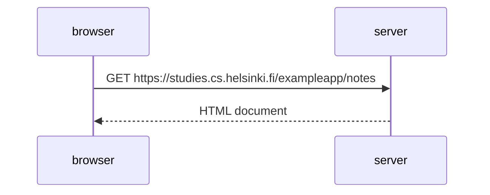

# FullStackOpenReact_SC
This is a repository made for the submissions to the University of Helsinki's Fullstack web development course

Here is a simple flow chart:

```mermaid
sequenceDiagram
    participant browser
    participant server
    browser->>server: GET https://studies.cs.helsinki.fi/exampleapp/notes
    server-->>browser: HTML document
    
```
