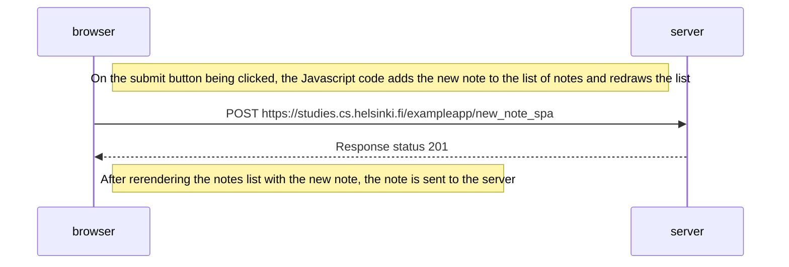

```mermaid
sequenceDiagram
    participant browser
    participant server

    Note right of browser: On the submit button being clicked, the Javascript code adds the new note to the list of notes and redraws the list
    browser->>server: POST https://studies.cs.helsinki.fi/exampleapp/new_note_spa
    server-->>browser: Response status 201

    Note right of browser: After rerendering the notes list with the new note, the note is sent to the server
```